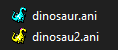

# dinosaur
Missing the Windows XP Dinosaur mouse pointers?

Bring them back to life in Windows 10/11 with this ...

----

From this repository, download these two animation files:

Save them to C:\Windows\Cursors

Then open:

Settings -> Mouse -> Additional mouse options

Then from Pointers tab:

Change 'Working in background' and 'Busy' pointers
